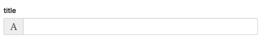
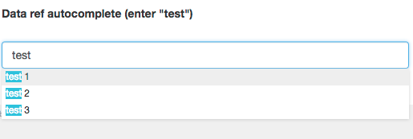
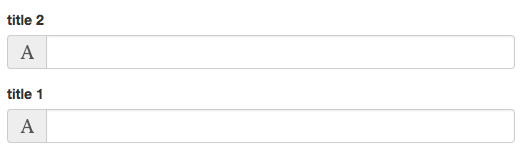
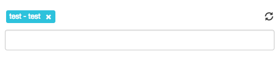

# Abe attributes

> abe tags can own many attributes

for example the type text, some required and other optional

```
{{abe type='text' key='text_key'}}
```

- type
- key

are always required for all content type

## <a name="abe-type"></a>Type of abe content

- [text](types/abe-text.md)
- [image](types/abe-image.md)
- [textarea](types/abe-textarea.md)
- [translate](types/abe-translate.md)
- [import](types/abe-import.md)
- [file](types/abe-file.md)
- [rich](types/abe-rich.md)
- [link](types/abe-link.md)
- [data](types/abe-data.md)
- [slug](types/abe-slug.md)

## Other attributes

- [tab](#tab)
- [key](#key)
- [type](#type)
- [autocomplete](#autocomplete)
- [desc](#desc)
- [display](#display)
- [editable](#editable)
- [max-length](#max-length)
- [min-length](#min-length)
- [source](#source)
- [duplicate](#duplicate)
- [reload](#reload)
- [required](#required)
- [visible](#visible)
- [order](#order)
- [filetype](#filetype)
- [file](#file)
- [locale](#locale)
- [prefill](#prefill)
- [prefill-quantity](#prefill-quantity)

## <a name="tab"></a>tab (String)

Default: "default"

```html
tab="NameOfTheTab"
```
Html input will be displayed into the tab `NameOfTheTab` 

Allowed:

- CamelCase
- Underscore
- Spaces
- Special charactères

## <a name="key"></a>key (String)

Default: ""

```html
key="keyData"
```
the key used into json file

Allowed:

- CamelCase
- Underscore
- Dot

Examples:

```html
{{abe type='text' key='title'}}
```

```json
{
	"title": "value"
}
```

```html
{{abe type='text' key='blog.title'}}
```

```json
{
	"blog": {
		"title": "value"
	}
}
```

> You can use dot json for keys the result will create json value when the data is saved
> 
> `mypage.content.title.value` as key will output
> 
> `{"mypage": {"content": {"title": {"value": ""}}}}`

## <a name="type"></a>type (String)

Default: "text"

```html
type="text"
```

Result:



Look at all abe type [here](#abe-type)

## <a name="autocomplete"></a>autocomplete (Boolean)

Default: null

```html
autocomplete="true"
```

Json example for autocomplete

```json
[
	{
		"id": 1,
		"name": "test 1",
		"lang": "de"
	},
	{
		"id": 2,
		"name": "test 2",
		"lang": "fr"
	},
	{
		"id": 3,
		"name": "test 3",
		"lang": "es"
	}
]
```



for abe type data, display input form autocomplete into admin

## <a name="desc"></a>desc (String)

Default: ""

```html
desc="some description for the contributor"
```
The admin description over the input

Allowed:

- CamelCase
- Underscore
- Spaces
- Special charactères

## <a name="display"></a>display (String)

Default: null

```html
display="variable"
```

for abe type data (autocomplete true or false)

Example:

```html
display="{{name}}"
```

Json

```json
[
	{
		"id": 1,
		"name": "test 1",
		"lang": "de"
	},
	{
		"id": 2,
		"name": "test 2",
		"lang": "fr"
	},
	{
		"id": 3,
		"name": "test 3",
		"lang": "es"
	}
]
```

the autocomplete value visible under the input will use `name` from json

- test 1
- test 2
- test 3


Multiple variables are allowed for example with our json:

```html
display="{{name}} - {{lang}}"
```

- test 1 - de
- test 2 - fr
- test 3 - es


## <a name="editable"></a>editable (Boolean)

Default: true

```html
editable="true"
```

if editable true user can change the value, if not abe will set the values

## <a name="max-length"></a>max-length (Int)

Default: null

```html
max-length="3"
```

for abe type data, array max selection

## <a name="min-length"></a>min-length (Int)

Default: 0

```html
min-length="1"
```

for abe type data, array min selection (if required)

## <a name="source"></a>source (String | variables)

Default: null

```html
source="[ source type ]"
```

see abe type [data](abe-data.md)

## <a name="duplicate"></a>duplicate (Boolean)

Default: true

```html
duplicate="true"
```

if set to false, when user duplicate a post. The value will not be duplicate into the new post

Example:

```html
{{abe type='text' key='title' duplicate="false"}}
```

Json before duplicate:

```json
{
  "abe_meta": {
    "template": "autocomplete",
    "link": "/test.html",
    "date": "2016-12-15T16:46:22.946Z",
  },
  "title": "test"
}
```

Json after duplicate:

value of title is not filled after duplicate the post with name `test-2.html`

```json
{
  "abe_meta": {
    "template": "autocomplete",
    "link": "/test-2.html",
    "date": "2016-12-15T16:46:22.946Z",
  },
  "title": ""
}
```

## <a name="reload"></a>reload (Boolean)

Default: false

```html
reload="true"
```

if reload true, on blur event on the input field the post preview will be reloaded

## <a name="required"></a>required (Boolean)

Default: false

```html
required="true"
```

If set to true user cannot publish the post without required field

Example:

```html
{{abe type="text" key="title" required="true"}}
```

> if submited but empty


## <a name="visible"></a>visible (Boolean)

Default: true

```html
visible="true"
```

if visible set to false, the value will not be set into post page (but will be visible on the admin and set into the json file)

## <a name="order"></a>order (Int)

Default: 0

```html
order="1"
```

to order the input in the admin

```html
{{abe type='text' key='title1' desc='title 1' order="2"}}
{{abe type='text' key='title2' desc='title 2' order="1"}}
```

`title1` is added before on the template but without order the result on the admin is inversed



## <a name="filetype"></a>filetype (String)

Default: ""

```html
filetype="image"
```

## <a name="file"></a>file (String)

Default: ""

```html
file="partial.html"
```

see abe [import](abe-import.md)

## <a name="locale"></a>locale (String | variable)

Default: ""

```html
locale="fr"
```

## <a name="prefill"></a>prefill (Boolean)

Default: false

```html
prefill="true"
```

For abe type data, if set to true will add default values

On the admin side prefill add a `reload` button on the right



## <a name="prefill-quantity"></a>prefill-quantity (Int)

Default: null

```html
prefill-quantity="3"
```

How many default values to prefill