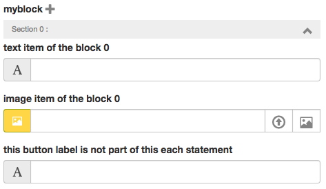
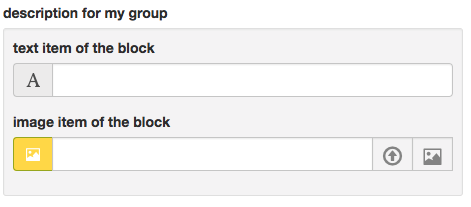

# Abe block each

> group elements

###Basic example

```html
{{#each myblock}}
​	<div>
		{{abe type='text' key='myblock.text' desc='text item of the block'}}
	</div>
​	

	<button>
		{{abe type='text' key='button' desc='this button label is not part of this each statement'}}
	</button>
{{/each}}
```

*Result :*



We have now a block each myblock that can be repeated as many time as we want with the '+' icon

Notice that since the <button> doesn't have ```key='myblock.button'``` but instead ```key='button'``` it won't be part of the each statement

When the input button will have some content, any item each from myblock will have the same text for the element button

Use case :

Each statement are usefull for exemple for Carousel, list of element with un unknow number of item etc ...


###Grouped element

Sometime we want to have a group of element but not inside of each statement because this group won't be repeated.

To do that, just use the same syntaxe as each block element but without wrapping them inside {{#each}} ... {{/each}} tag

```html
	<div>
		{{abe type='text' key='myblock.text' groupdesc='description for my group' desc='text item of the block'}}
	</div>
​	
```

Notice groupdesc attribut that is use to write a description for our single grouped element 

*Result :*

